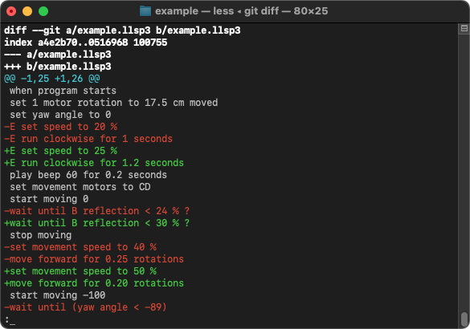

# flippertools

flippertools provides command line tools for working with LEGO MINDSTORMS EV3 Classroom and SPIKE project files (.lmsp, .llsp, .llsp3). *flippertools* can also be used with git to show differences between versions of project files in a repository.

Icon Blocks, Word Blocks, and Python projects for EV3, SPIKE Essential, and SPIKE Prime are all supported.

* **flipperdiff**: Shows the differences between two project files in unified diff format.
* **flipper2text**: Converts project files to text.
* **flipper2svg**: Converts project files to SVG.

Flipper is the internal code name for SPIKE, hence the name *flippertools*.



## Windows
### Running the Tools
* *flippertools* requires Python 3.10 or higher. If you don't already have Python installed, download and install the latest version from https://python.org/.
* Download and extract the latest ZIP of *flippertools* from GitHub. https://github.com/astrospark/flippertools/archive/refs/heads/main.zip
* Open `Command Prompt` and change to the directory where you extracted *flippertools*.  
  For example: `cd %USERPROFILE%\Downloads\flippertools-main`
* Run the tool.  
  For example: `flipper2text example.llsp`
* The first time you run one of the tools, it will create a Python virtual environment and download required packages. This may take a few seconds.  

### Using *flippertools* with git
* Add the section below to your `%USERPROFILE%\.gitconfig`. Change the textconv line to point to the full path of `flipper2text.cmd`. Make sure the path is surrounded by escaped quotation marks (`\"`).
  ```
  [diff "flipper"]
      textconv = \"C:/Users/Example/Downloads/flippertools-main/flipper2text.cmd\"
  ```
* In each git repository you want to use with *flippertools*, add the following lines to `.gitattributes`:
  ```
  *.lmsp  diff=flipper
  *.llsp  diff=flipper
  *.llsp3 diff=flipper
  ```
* The `git diff` command will now be able to show you the differences between versions of project files. You can still only stage and commit entire project files, though. You can't use interactive staging or merge changes from different versions together.

## macOS
### Running the Tools
* *flippertools* requires Python 3.10 or higher. If you don't already have Python installed, download and install the latest version from https://python.org/.
* Download and extract the latest ZIP of *flippertools* from GitHub. https://github.com/astrospark/flippertools/archive/refs/heads/main.zip
* Open `Terminal` and change to the directory where you extracted *flippertools*.  
  For example: `cd ~/Downloads/flippertools-main`
* Run the tool.  
  For example: `./flipper2text example.llsp`
* The first time you run one of the tools, it will create a Python virtual environment and download required packages. This may take a few seconds.  

### Using *flippertools* with git
* Add the section below to your `~/.gitconfig`. Change the textconv line to point to the path of `flipper2text`. If there are any spaces in the path, escape them with a backslash (`\`).
  ```
  [diff "flipper"]
      textconv = ~/Downloads/flippertools-main/flipper2text
  ```
* In each git repository you want to use with *flippertools*, add the following lines to `.gitattributes`:
  ```
  *.lmsp  diff=flipper
  *.llsp  diff=flipper
  *.llsp3 diff=flipper
  ```
* The `git diff` command will now be able to show you the differences between versions of project files. You can still only stage and commit entire project files, though. You can't use interactive staging or merge changes from different versions together.

## Usage
### flipperdiff
Shows the differences between two LEGO MINDSTORMS EV3 Classroom or SPIKE project files.
```
usage: flipperdiff [--help] [--version] [-d] file1 file2

options:
  -d, --dump  compare everything in the project files
  file1       the name of the first file to compare
  file2       the name of the second file to compare
```
### flipper2text
Converts LEGO MINDSTORMS EV3 Classroom and SPIKE project files to text.
```
usage: flipper2text [--help] [--version] [-d] [-f] infile [outfile]

options:
  -d, --dump   dump everything in the project file
  -f, --force  overwrite existing file
  infile       the name of the project file
  outfile      the name of the text file to output
```
### flipper2svg
Converts LEGO MINDSTORMS EV3 Classroom and SPIKE project files to SVG.
```
usage: flipper2svg [--help] [--version] [-f] infile [outfile]

options:
  -f, --force  overwrite existing file
  infile       the name of the project file
  outfile      the name of the SVG file to output
```

LEGO, MINDSTORMS, and SPIKE are trademarks of the LEGO Group. This software is not authorized or endorsed by the LEGO Group.
